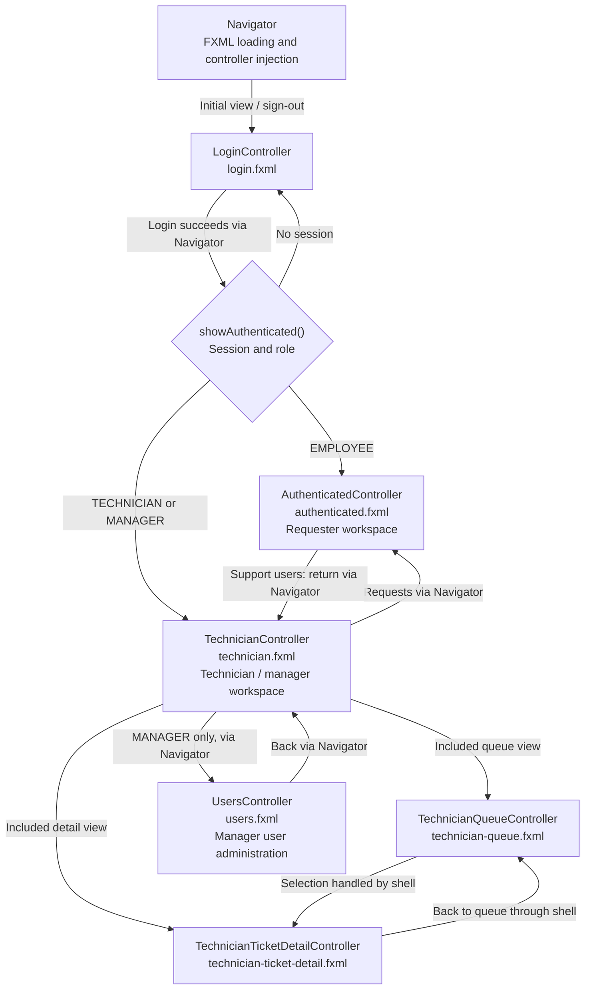
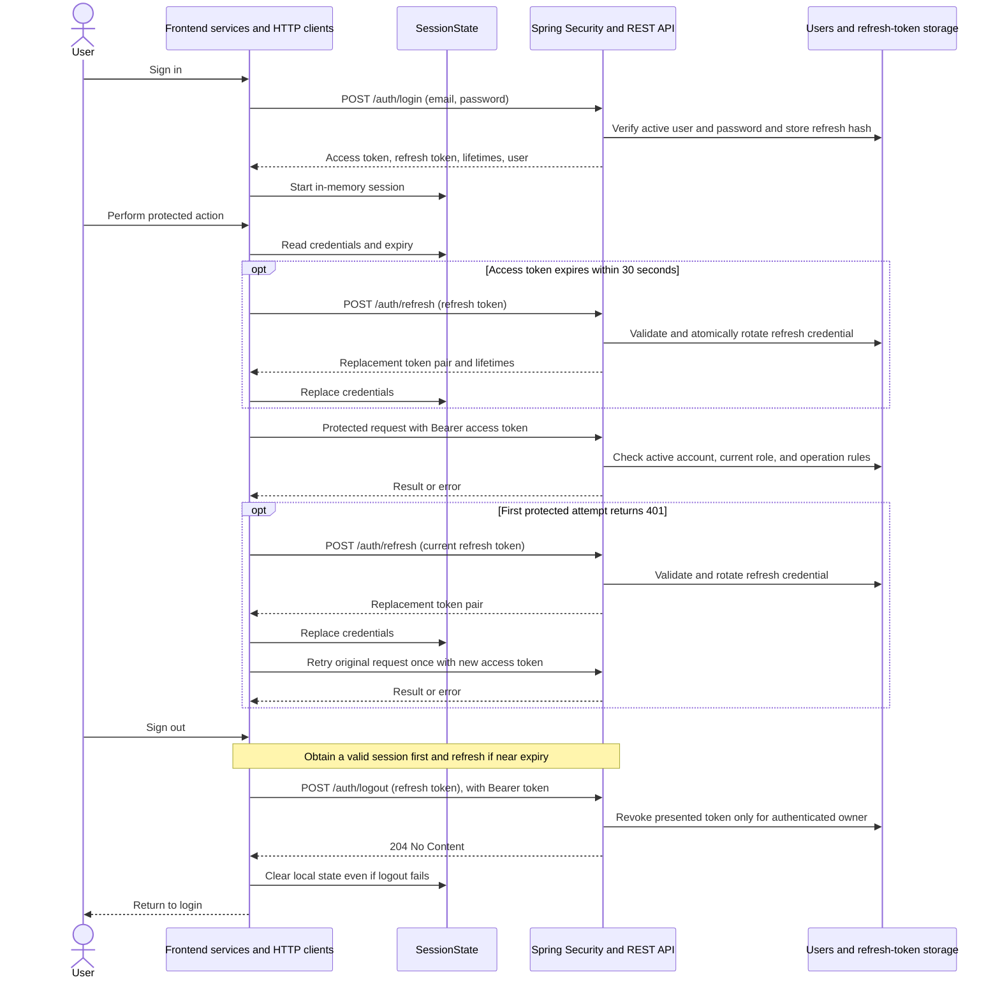
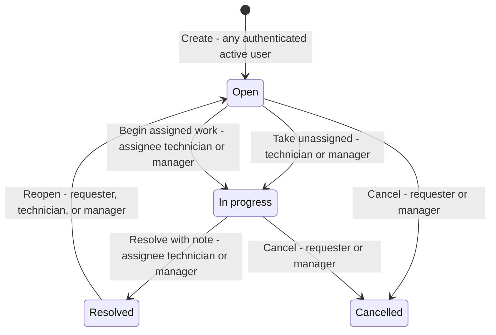
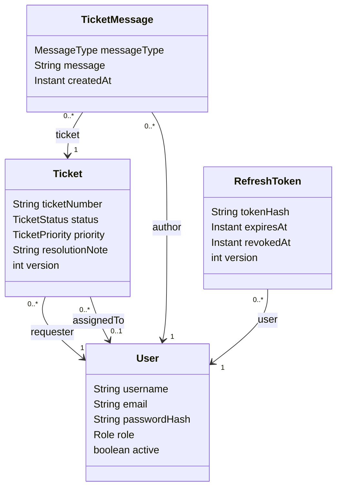
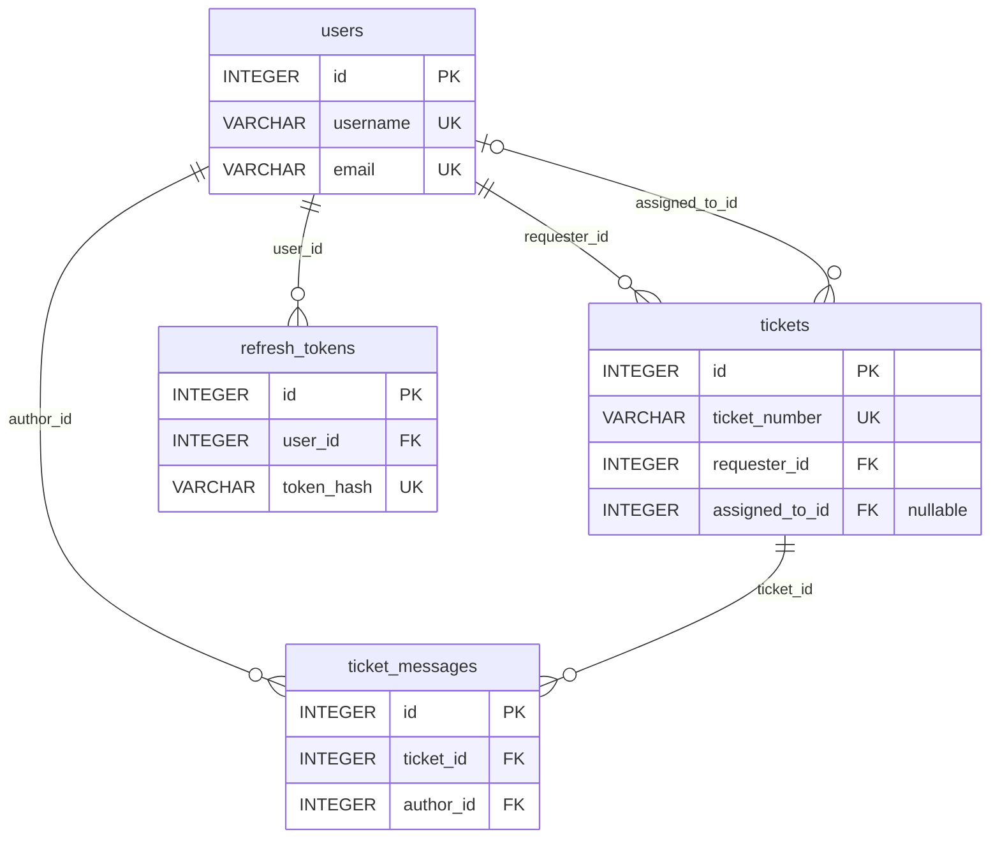

# ResolveIT Developer Guide

## 1. Introduction

ResolveIT is an internal IT help-desk application with a JavaFX desktop client
and a Spring Boot REST backend. Employees submit and track requests,
technicians work on tickets, and managers can also assign tickets and
administer accounts.

This Developer Guide describes the architecture, major frontend and backend
components, REST contracts, authentication and authorization, ticket workflows,
persistence, testing, CI/CD, and the software engineering practices used during
development.

The current application includes authentication, requester ticket workflows,
support queues, public comments, internal notes, and manager user administration.
Attachments, reporting dashboards, email notifications, and service-level
targets remain outside the current scope.

## 2. Repository structure and development setup

### 2.1 Repository map

The backend and frontend are independent Gradle projects, each with its own
`settings.gradle`, build file, and wrapper. They share REST contracts but no Java
source module. Run Gradle from the relevant module directory.

| Location | Contents |
|---|---|
| [`backend/src/main/java/resolveit`](../backend/src/main/java/resolveit) | Spring Boot entry point; `auth`, `user`, `ticket`, `config`, and `common` packages. |
| [`backend/src/main/resources`](../backend/src/main/resources) | `application.yml` and the database definition in `schema.sql`. |
| [`backend/src/test/java/resolveit`](../backend/src/test/java/resolveit) | Backend integration tests and focused authentication/seeding tests. |
| [`frontend/src/main/java/resolveit/frontend`](../frontend/src/main/java/resolveit/frontend) | JavaFX entry points; navigation, UI, session, configuration, models, services, and HTTP clients. |
| [`frontend/src/main/resources/resolveit/frontend`](../frontend/src/main/resources/resolveit/frontend) | FXML views in `views/` and shared styling in `styles/app.css`. |
| [`frontend/src/test/java/resolveit/frontend`](../frontend/src/test/java/resolveit/frontend) | Validation, service, HTTP, configuration, session, and JavaFX view tests. |
| [`config/checkstyle`](../config/checkstyle) | Checkstyle configuration shared by both builds. |
| [`.github/workflows`](../.github/workflows) | Application checks, packaging/release workflow, and website deployment. |
| [`docs`](.) and [`requirements`](../requirements) | Developer/user documentation, reflections, website source, and specifications. |
| [`.agents/skills`](../.agents/skills) and [`.agents/evals`](../.agents/evals) | Project skills and their evaluation harness/test cases. |
| [`logs`](../logs) | Development interaction summaries. |

### 2.2 Prerequisites and build configuration

Install JDK 25 and make it available to the terminal and IDE. Import `backend/`
and `frontend/` as separate Gradle projects and use their checked-in wrappers.
Both builds request a Java 25 toolchain. The wrappers select Gradle 9.7.0, so a
separate system Gradle installation is unnecessary.

The [backend build](../backend/build.gradle) uses Spring Boot 4.1.1, Spring MVC,
Spring Security, Spring Data JPA, Hibernate's community SQLite dialect, and the
SQLite JDBC driver. The [frontend build](../frontend/build.gradle) uses JavaFX
25.0.1 (`javafx.controls` and `javafx.fxml`) and Jackson for JSON. Gradle resolves
dependencies from Maven Central. A graphical desktop is needed to run the client;
the Linux CI workflow uses Xvfb for JavaFX tests.

### 2.3 Start a local development session

Open two terminals at the repository root. In the first, start the backend:

```powershell
cd backend
.\gradlew.bat bootRun
```

In the second, start the frontend:

```powershell
cd frontend
.\gradlew.bat run
```

On Linux, use `./gradlew bootRun` and `./gradlew run` in the corresponding
directories. The API defaults to `http://localhost:8080/api/v1`; the client defaults
to the same API with a trailing slash. Keep the backend running while using the
client.

[DemoDataSeeder](../backend/src/main/java/resolveit/config/DemoDataSeeder.java)
runs by default and inserts 34 active accounts only when the users table is empty:
one manager, three technicians, and 30 employees. See the backend README for the
account credentials. Set `resolveit.demo-data.enabled=false` to disable seeding.
These accounts are for demonstration, not production use.

### 2.4 Local configuration

| Setting | Default and behavior | Implementation |
|---|---|---|
| `RESOLVEIT_API_BASE_URL` | `http://localhost:8080/api/v1/`; the frontend trims the value and adds a trailing slash when absent. It requires an absolute HTTP(S) URL without embedded credentials. | [AppConfig](../frontend/src/main/java/resolveit/frontend/config/AppConfig.java) |
| `RESOLVEIT_DB_PATH` | `resolveit.db`, relative to the backend process working directory; SQLite creates the database file as needed. | [application.yml](../backend/src/main/resources/application.yml) |
| `RESOLVEIT_JWT_SECRET` | A checked-in development-only fallback. An override must be Base64-encoded and decode to at least 32 bytes. | `application.yml` and [SecurityConfig](../backend/src/main/java/resolveit/config/SecurityConfig.java) |

Set environment variables in the terminal that launches the relevant process. For
example, to point the frontend at a different local backend port in PowerShell:

```powershell
$env:RESOLVEIT_API_BASE_URL = 'http://localhost:8081/api/v1/'
.\gradlew.bat run
```

This changes the client's destination; the backend must separately be configured
to listen there. The checked-in backend configuration does not configure TLS.
The product specification requires HTTPS outside local development, so a deployed
API needs additional HTTPS configuration and an external JWT secret.

## 3. System architecture and design decisions

### 3.1 Processes and communication boundary

ResolveIT is a two-process desktop application. The JavaFX process sends JSON REST
requests to the Spring Boot API. Only the backend accesses SQLite. Local development
runs both processes on the same machine; the configurable API URL also allows the
client to address a separate backend host.

```mermaid
flowchart LR
    subgraph Desktop["JavaFX desktop frontend process"]
        UI["FXML views and controllers"]
        FS["Frontend services"]
        SESSION["AuthService and SessionState<br/>Credentials held in memory"]
        HTTP["Java HTTP clients"]
        UI --> FS
        FS --> HTTP
        FS --> SESSION
        SESSION --> HTTP
    end
    subgraph Server["Spring Boot REST API process"]
        SECURITY["Spring Security boundary<br/>JWT, active-user and role checks"]
        API["REST controllers<br/>Authentication, tickets and users"]
        BS["Backend services<br/>Business rules and transactions"]
        RP["Spring Data JPA repositories"]
        SECURITY --> API
        API --> BS
        BS --> RP
    end
    HTTP -->|"JSON requests: /api/v1<br/>Bearer JWT on protected calls"| SECURITY
    API -.->|"JSON responses, tokens and errors"| HTTP
    RP -->|"JDBC reads and writes"| DB[("SQLite database file<br/>Users, tickets, messages, refresh-token hashes")]
```



The request arrow crosses the authentication/session boundary. Login and refresh
are public routes; protected calls require authentication. The backend uses
stateless Spring Security rather than an HTTP login session. The desktop keeps
its own credentials and user details in `SessionState`.

### 3.2 Layer responsibilities and dependency wiring

- **Frontend:** FXML controllers coordinate views. Services in `auth`, `ticket`,
  and `user` contain validation and use-case logic. `HttpAuthClient` handles
  authentication requests; `HttpTicketClient` implements both `TicketClient` and
  `ManagerClient` for ticket and manager operations.
- **Backend:** REST controllers validate request shapes and delegate to services.
  `TicketService` enforces ticket visibility, permissions, and lifecycle rules;
  `UserService` handles account validation and updates. `SecurityConfig` protects
  manager user-administration routes. Services use transactions and repositories
  for persistence.
- **Persistence:** Spring Data repositories persist `User`, `Ticket`,
  `TicketMessage`, and `RefreshToken`. The version-controlled `schema.sql` creates
  missing tables and indexes; Hibernate validates the schema at startup.

The frontend
[ResolveItApplication](../frontend/src/main/java/resolveit/frontend/ResolveItApplication.java)
constructs the clients, session, services, and `Navigator` explicitly. The backend
[ResolveItApplication](../backend/src/main/java/resolveit/ResolveItApplication.java)
starts Spring Boot, which supplies the annotated controllers, services,
repositories, and configuration beans. The two projects maintain their own Java
models and DTOs, so a REST contract change must be reflected on both sides.

### 3.3 Authentication and persistence decisions

The backend authentication service issues 15-minute HS256 JWT access tokens using
the security configuration. Protected requests check that the account is active;
role authorities are read from the current database account. Refresh tokens are
opaque credentials stored as hashes, expire after seven days, rotate on use, and
can be revoked. Repeated failed logins are temporarily limited by normalized email
and direct client address. See
[AuthService](../backend/src/main/java/resolveit/auth/AuthService.java),
[RefreshTokenService](../backend/src/main/java/resolveit/auth/RefreshTokenService.java),
and [LoginAttemptLimiter](../backend/src/main/java/resolveit/auth/LoginAttemptLimiter.java).

The frontend renews near-expiry access tokens and shares one refresh operation
among concurrent callers. Protected HTTP operations retry once after an
unauthorized response. Sign-out attempts server-side refresh-token revocation and
always clears local session state. Credentials are held only in process memory;
closing the application requires a fresh login on the next launch. Application
shutdown closes the HTTP clients; it does not invoke the logout endpoint.

SQLite uses one pooled connection with foreign keys enabled. Ticket `version`
provides optimistic locking, while taking a ticket uses a conditional atomic
update in
[TicketRepository](../backend/src/main/java/resolveit/ticket/TicketRepository.java).
This serializes connection use within the backend pool; it does not replace the
workflow and concurrency checks. The schema initialization is not a migration
system for existing databases.

### 3.4 UI responsiveness and authority

Both HTTP clients run network work through virtual-thread executors. Controllers
marshal UI updates back to the JavaFX Application Thread. Views expose loading and
failure states and refresh data manually or after successful changes; the client
does not subscribe to server events.

Role-dependent controls help users discover available actions. The backend remains
the authority for access, ownership, and state transitions. Stable REST payloads
and error codes connect these layers because the client maps failures to
user-facing messages.

## 4. Frontend architecture and navigation

### 4.1 Entry points and package responsibilities

The Gradle `run` task starts `ResolveItApplication`. The packaged JAR uses
[Launcher](../frontend/src/main/java/resolveit/frontend/Launcher.java), which calls
that application entry point. `ResolveItApplication.start` loads configuration,
constructs shared dependencies, sets the stage title and minimum dimensions, and
shows the login view.

| Package | Responsibility |
|---|---|
| `config` | Load and validate the API base URL. |
| `navigation` | Load top-level views, supply controllers, route by role, and manage view lifecycle. |
| `ui` | FXML event handlers, view state, asynchronous UI coordination, and rendering. |
| `auth` and `session` | Login, refresh, logout, authentication HTTP contracts, and in-memory session state. |
| `ticket` | Ticket models/contracts, validation, employee/support services, and HTTP operations. |
| `user` | Manager service and client interface for user administration and assignment. |
| `model` | Shared frontend user and role types. |

### 4.2 Workspaces and role routing

[Navigator](../frontend/src/main/java/resolveit/frontend/navigation/Navigator.java)
loads resources from `resolveit/frontend/views/`. After login,
`showAuthenticated()` sends employees to the requester workspace and technicians
or managers to the shared support workspace. If no session exists, it shows login.



The arrows describe navigation and view composition. Top-level workspace changes
pass through `Navigator`; queue/detail changes happen inside `TechnicianController`.
Managers reuse the support shell with manager-specific controls and an All Tickets
queue. Both technicians and managers can open the requester workspace and return
to support. User administration is a separate view available to managers.

### 4.3 View and controller map

All controllers below are in
[`resolveit.frontend.ui`](../frontend/src/main/java/resolveit/frontend/ui), and their
FXML files are in the
[`views` directory](../frontend/src/main/resources/resolveit/frontend/views).

| FXML | Controller | Responsibility |
|---|---|---|
| `login.fxml` | `LoginController` | Login validation, password visibility, submission state, and navigation after authentication. |
| `authenticated.fxml` | `AuthenticatedController` | Requester ticket list, submission form, and ticket details within one workspace; editing, comments, cancellation, and reopening. |
| `technician.fxml` | `TechnicianController` | Support shell; coordinates queue/detail child views, requester navigation, manager navigation, and sign-out. |
| `technician-queue.fxml` | `TechnicianQueueController` | Ticket queue, filters, pagination, refresh, and ticket-selection callbacks. |
| `technician-ticket-detail.fxml` | `TechnicianTicketDetailController` | Support ticket actions and conversation; manager assignment controls. |
| `users.fxml` | `UsersController` | Manager account listing, creation, editing, access-change confirmation, and return navigation. |

`technician.fxml` includes the queue and detail FXML files with `fx:include`.
The loader's controller factory supplies their service dependencies, and the shell
receives the child controllers through FXML injection. The shell switches child
visibility and connects selection, return, refresh, and busy-state callbacks.

`TechnicianTicketDetailLoader` combines ticket and message requests and delivers
results on the JavaFX thread. `TechnicianTicketDetailRenderer` populates ticket
fields and available-action controls. These helpers support the detail controller
without becoming separate navigable views.

### 4.4 View lifecycle, shared styling, and asynchronous work

For each top-level navigation, `Navigator` creates an `FXMLLoader`, installs a
controller factory, and loads the next view. Once loading succeeds, it calls
`dispose()` on the previous controller. The first view creates a `Scene` at
1120 by 720; subsequent navigation replaces its root rather than recreating the
stage or resetting the window size. `ResolveItApplication` sets the stage minimum
to 900 by 620.

The scene loads the shared
[`app.css`](../frontend/src/main/resources/resolveit/frontend/styles/app.css)
stylesheet. Layout structure and view-specific style classes are declared in FXML.
After installing a view, `Navigator` calls its `onShown()` callback. Top-level
controllers implement
[ViewLifecycle](../frontend/src/main/java/resolveit/frontend/navigation/ViewLifecycle.java);
`TechnicianController.dispose()` also disposes its queue and detail children.

Controllers use services rather than making HTTP calls directly.
[AsyncOperationTracker](../frontend/src/main/java/resolveit/frontend/ui/AsyncOperationTracker.java)
tracks controller-owned futures, dispatches completion callbacks with
`Platform.runLater`, suppresses callbacks for disposed views, and requests
cancellation during cleanup. The requester and support views use loading flags
and disabled controls to prevent duplicate actions while requests are pending.

## 5. Frontend services, asynchronous work, and failure handling

### 5.1 Services and client boundaries

Controllers express user intent through services. These services depend on client
interfaces so tests can supply substitutes without a running backend. They return
`CompletionStage` results rather than blocking the JavaFX Application Thread.

| Service | Responsibilities and client dependency |
|---|---|
| [AuthService](../frontend/src/main/java/resolveit/frontend/auth/AuthService.java) | Uses `AuthClient` for login, refresh, and logout; implements `AuthenticatedSession` for protected HTTP operations. |
| [EmployeeTicketService](../frontend/src/main/java/resolveit/frontend/ticket/EmployeeTicketService.java) | Wraps `TicketClient` for listing, creating, editing, reading, commenting, cancelling, and reopening tickets. Requests pages of 20 and trims public comments. |
| [TechnicianTicketService](../frontend/src/main/java/resolveit/frontend/ticket/TechnicianTicketService.java) | Maps queue assignment filters to API flags; exposes take, begin-work, priority, message, resolve, cancel, and reopen operations. Trims message and resolution text. |
| [ManagerService](../frontend/src/main/java/resolveit/frontend/user/ManagerService.java) | Uses `ManagerClient` for user administration, assignable users, and ticket assignment. Supplies form validation and selects create versus update based on whether an ID exists. |

`HttpAuthClient` implements `AuthClient`. `HttpTicketClient` implements both
`TicketClient` and `ManagerClient`; there is no separate manager HTTP implementation.
The requester service delegates visibility to the backend: using that service does
not itself restrict a support user's API results to tickets they requested.

Client validation is distributed across `LoginValidator`, `TicketValidator`,
`ManagerService.validate`, and controller checks. The backend independently validates
every request; a successful client-side check does not confer permission.

### 5.2 HTTP execution and UI lifecycle

[HttpAuthClient](../frontend/src/main/java/resolveit/frontend/auth/HttpAuthClient.java)
and [HttpTicketClient](../frontend/src/main/java/resolveit/frontend/ticket/HttpTicketClient.java)
run blocking Java HTTP calls on virtual-thread executors. Both default to a
five-second connection timeout and a 15-second request timeout. JSON serialization
and parsing happen in this client layer. Closing a client shuts down its executor.

Controllers deliver completion results through `Platform.runLater` and maintain
loading flags to prevent duplicate actions. `AsyncOperationTracker` tracks futures,
skips callbacks after disposal, and requests cancellation when a view is replaced.
`UsersController` maintains its own pending-future set with equivalent disposal
checks. Cancellation requests and ignoring late UI results do not undo a mutation
that the backend has already accepted.

`TechnicianTicketDetailLoader` requests the ticket and its messages, combines their
results, and delivers them together on the JavaFX thread. The support detail view
marks displayed data stale after a failed reload and disables its actions until a
successful refresh. The queue also disables stale ticket selection after a refresh
failure. See the [UI controllers and helpers](../frontend/src/main/java/resolveit/frontend/ui).

### 5.3 Failure mapping and recovery

`HttpTicketClient` retains a server error's `code` and `message` in `TicketFailure`
and maps HTTP status to a failure kind:

| Response or failure | Client kind |
|---|---|
| `400` | `INVALID_REQUEST` |
| `401` | `UNAUTHORIZED` |
| `403` | `FORBIDDEN` |
| `404` | `NOT_FOUND` |
| `409` | `CONFLICT` |
| Other unsuccessful HTTP status | `SERVER` |
| Successful response with unparseable JSON | `INVALID_RESPONSE` |
| Request timeout | `TIMEOUT` |
| I/O failure or interrupted request | `CONNECTION` |

If an error body cannot be parsed, the client uses a status-based fallback.
`HttpAuthClient` separately maps authentication failures, including invalid
credentials, rate limiting, expired sessions, timeouts, and unavailable servers,
through `AuthFailure`.

Before a protected operation, `HttpTicketClient` obtains a valid session. If the
first HTTP attempt returns `401`, it refreshes credentials and retries the request
once. It does not repeatedly retry failures or automatically retry conflicts.
Requester and support detail controllers reload ticket state after conflicts;
unauthorized failures clear local session state and return to login. Other failures
are displayed in the relevant view, with loading controls restored as appropriate.

## 6. Backend layers and request processing

### 6.1 Component responsibilities

The backend packages organize code by authentication, tickets, and users, with
shared security configuration and error handling:

| Area | Entry points and implementation |
|---|---|
| Authentication | [AuthController](../backend/src/main/java/resolveit/auth/AuthController.java) delegates login, refresh, and logout to `AuthService`; `/auth/me` reads the current user through `UserRepository`. `RefreshTokenService` owns token persistence and rotation. |
| Tickets and messages | [TicketController](../backend/src/main/java/resolveit/ticket/TicketController.java) delegates to `TicketService`. `TicketRepository` supports JPA specifications and atomic taking; `TicketMessageRepository` supports visible message queries. |
| User administration | [UserController](../backend/src/main/java/resolveit/user/UserController.java) delegates to `UserService` and `UserRepository`. |
| Security | [SecurityConfig](../backend/src/main/java/resolveit/config/SecurityConfig.java) configures password encoding, JWT validation, stateless authentication, and manager-only routes. |
| Shared errors | [ApiException](../backend/src/main/java/resolveit/common/ApiException.java) carries application status/code/message; `ApiExceptionHandler` translates application and framework exceptions. |

### 6.2 Request processing and transactions

A protected request passes through Spring Security before its controller is called.
Controllers deserialize request DTOs, apply `@Valid` where declared, and bind path
and query parameters. Services apply rules that require the current account or
persisted state, such as ownership, assignment eligibility, and ticket transitions.

Bean Validation checks DTO constraints such as required fields and length bounds.
Services perform additional normalization and business checks. For example,
`TicketService` trims ticket text and enforces minimum subject and description
lengths. A ticket edit DTO also tracks whether each editable field was supplied.

`TicketService` and `UserService` use read-only transactions for reads and write
transactions for mutations. Ticket updates use `saveAndFlush` so the returned DTO
includes the flushed version. `AuthService.login` is transactional;
`RefreshTokenService` owns the transactional issue, rotation, and revocation
operations used by authentication flows. Do not assume every authentication method
has one encompassing transaction: `AuthService.refresh` calls transactional rotation
and then issues the access token.

Response DTOs are explicitly constructed from entities. Ticket responses contain
requester/assignee identifiers and names, rather than serializing JPA relationships.
User responses omit password hashes, and ticket responses do not embed message
history. With `spring.jpa.open-in-view=false`, ticket and user services map entity
data while their transactions are active.

### 6.3 Authorization and error boundaries

`SecurityConfig` requires manager authority for `/api/v1/users/**` and
`/api/v1/technicians`. `UserService` relies on that HTTP security boundary; it does
not repeat the manager check internally. `TicketService` checks the active current
user and enforces its own operation-specific permissions and visibility.

`ApiExceptionHandler` maps invalid bodies, invalid parameters, DTO validation,
application failures, optimistic-lock failures, and unexpected exceptions to JSON.
Authentication and access-denied failures intercepted before the controller use
JSON handlers in `SecurityConfig`. Both paths use the same three-field error shape.
Unexpected exceptions return a generic `500 INTERNAL_ERROR` message.

## 7. REST API contracts

### 7.1 Conventions and endpoint catalogue

All paths below are relative to `/api/v1`. Bodies and responses use JSON, except
successful logout, which has no response body. Protected requests carry
`Authorization: Bearer <accessToken>`. Enum values use their uppercase Java names.

| Method and path | Request / response and main rule |
|---|---|
| `POST /auth/login` | `email`, `password` → initial tokens and user; public. |
| `POST /auth/refresh` | `refreshToken` → replacement tokens; public route requiring a usable refresh credential. |
| `POST /auth/logout` | `refreshToken` → `204`; authenticated, owner-scoped revocation. |
| `GET /auth/me` | Current `UserResponse`; authenticated. |
| `POST /tickets` | `subject`, `description`, `category`, `priority` → new ticket for the caller. |
| `GET /tickets` | Page of tickets visible to the caller, with filters below. |
| `GET /tickets/{id}` | Visible ticket. |
| `PATCH /tickets/{id}` | Editable fields and required `version` → updated ticket; requester only. |
| `POST /tickets/{id}/take` | No body → atomically self-assigned, in-progress ticket; support roles. |
| `POST /tickets/{id}/assign` | `technicianId` → assigned ticket; manager only. |
| `PATCH /tickets/{id}/status` | `status` → updated ticket; only the begin-work transition is accepted here. |
| `PATCH /tickets/{id}/priority` | `priority` → updated ticket; support roles. |
| `POST /tickets/{id}/cancel` | No body → cancelled ticket; requester or manager. |
| `POST /tickets/{id}/reopen` | No body → reopened ticket; requester or support roles. |
| `POST /tickets/{id}/resolve` | `resolutionNote` → resolved ticket; assigned technician or manager. |
| `GET /tickets/{id}/messages` | Page of visible messages. |
| `POST /tickets/{id}/messages` | `messageType`, `message` → created message. |
| `GET /users` | Page of accounts, optionally filtered by `role`; manager only. |
| `POST /users` | Account fields → created user; manager only. |
| `PATCH /users/{id}` | Account fields → updated user; manager only. |
| `GET /technicians` | Array of active technicians and managers, ordered by username; manager only. |

Creation endpoints for tickets, messages, and users return `201`; other successful
JSON operations return `200`. Lifecycle preconditions are detailed in Section 9.
The concrete contracts are in [AuthDtos](../backend/src/main/java/resolveit/auth/AuthDtos.java),
[TicketDtos](../backend/src/main/java/resolveit/ticket/TicketDtos.java), and
[UserDtos](../backend/src/main/java/resolveit/user/UserDtos.java).

### 7.2 Pagination, filters, and response shapes

Paged responses contain `content`, `page`, `size`, `totalElements`, and `totalPages`.
Page indices start at zero; `page` must be non-negative and `size` must be 1–100.

| List | Defaults | Ordering and optional filters |
|---|---|---|
| Tickets | `page=0`, `size=20` | `createdAt`, then `id`, descending; `status`, `priority`, `assignedToId`, `assignedToMe`, `unassigned`. |
| Messages | `page=0`, `size=50` | `createdAt`, then `id`, ascending; employee queries include only public comments. |
| Users | `page=0`, `size=20` | `id` ascending; optional `role`. |

Only one of `assignedToId`, `assignedToMe=true`, and `unassigned=true` may be active.
Supplying `assignedToId` requires a manager. Filters narrow the role-visible ticket
set; they do not bypass visibility. `/technicians` returns an unpaged array.

A ticket response includes `id`, `ticketNumber`, subject/description, category,
priority, status, requester/assignee IDs and usernames, resolution note, timestamps,
and `version`. Assignee and resolution fields can be null. A message response
contains its ticket and author IDs, author username, type, text, and creation time.
A user response contains ID, username, email, role, activation status, and timestamps.

Login returns `accessToken`, `refreshToken`, `tokenType`, `expiresIn`,
`refreshExpiresIn`, and `user`. Refresh returns the same credential fields without
`user`. Lifetimes are expressed in seconds; timestamp fields use `Instant` values.

### 7.3 Ticket payloads and partial updates

A create request contains the four user-editable ticket fields:

```json
{
  "subject": "Cannot connect to Wi-Fi",
  "description": "My laptop reports an authentication error.",
  "category": "NETWORK",
  "priority": "MEDIUM"
}
```

An edit supplies the version from the latest ticket response and at least one field:

```json
{
  "subject": "Cannot connect to office Wi-Fi",
  "priority": "HIGH",
  "version": 0
}
```

Omitted editable fields remain unchanged. Explicit null values and unknown fields
are rejected, including protected properties such as status, requester, and
assignment. Missing versions produce `VERSION_REQUIRED`; negative or stale versions
produce `TICKET_VERSION_CONFLICT`. An edit with no editable fields produces
`EMPTY_UPDATE`.

Ticket subjects must contain 5–200 characters after trimming; descriptions
10–10,000; messages 1–5,000; resolution notes 1–10,000. DTO constraints also apply
before normalization. Categories are `HARDWARE`, `SOFTWARE`, `NETWORK`,
`ACCOUNT_ACCESS`, and `OTHER`; priorities are `LOW`, `MEDIUM`, and `HIGH`.

Other representative bodies are `{"technicianId":12}` for assignment,
`{"status":"IN_PROGRESS"}` for beginning work,
`{"resolutionNote":"Replaced the network profile."}` for resolution, and
`{"messageType":"PUBLIC_COMMENT","message":"The issue persists."}` for a comment.

### 7.4 Error contract and client compatibility

Errors use a stable structure, for example:

```json
{
  "status": 409,
  "code": "TICKET_VERSION_CONFLICT",
  "message": "The ticket was modified by another request."
}
```

| Status | Representative codes / meaning |
|---|---|
| `400` | `VALIDATION_FAILED`, `INVALID_REQUEST`, `INVALID_PARAMETER`, `INVALID_PAGINATION`, `INVALID_FILTER`, `EMPTY_UPDATE`. |
| `401` | `UNAUTHORIZED`, `INVALID_CREDENTIALS`, `INVALID_REFRESH_TOKEN`. |
| `403` | `ACCESS_DENIED`; the caller lacks permission. |
| `404` | `TICKET_NOT_FOUND` for missing or inaccessible tickets; `USER_NOT_FOUND` for a missing account. |
| `409` | `TICKET_VERSION_CONFLICT`, `TICKET_NOT_AVAILABLE`, `TICKET_NOT_EDITABLE`, `INVALID_STATUS_TRANSITION`, `USER_ALREADY_EXISTS`. |
| `429` | `LOGIN_RATE_LIMITED`, with `Retry-After` in seconds. |
| `500` | `INTERNAL_ERROR`, with a generic message. |

Frontend contracts are defined independently in `auth`, `ticket`, and `user`.
When changing a backend DTO or error code, update the corresponding client models,
HTTP mapping, and affected tests. Useful contract checks include
[HttpAuthClientTest](../frontend/src/test/java/resolveit/frontend/auth/HttpAuthClientTest.java)
and [HttpTicketClientTest](../frontend/src/test/java/resolveit/frontend/ticket/HttpTicketClientTest.java).

## 8. Authentication, authorization, and session lifecycle

### 8.1 Server authentication and authorization

`SecurityConfig` uses BCrypt password encoding and stateless bearer authentication,
with CSRF protection disabled. Login looks up email case-insensitively, checks the
account is active, and verifies its password hash. Unknown accounts, inactive
accounts, and incorrect passwords all return `INVALID_CREDENTIALS`.

Access tokens use HS256 and the configured issuer (`resolveit-backend` by default).
Claims include email as subject, user ID as `uid`, issue/expiry times, and a random
token ID. Validation checks signature, issuer, token timestamps, and a matching
active database account. Authorities are derived from the account's current role,
not a role claim in the token.

The default access lifetime is 15 minutes and refresh lifetime is seven days.
`RefreshTokenService` generates 32 random bytes for a URL-safe opaque credential
and stores only its SHA-256 hash. Rotation checks expiry, revocation, and active
ownership, conditionally revokes the old token, and inserts its replacement within
a transaction. The previous credential cannot successfully rotate twice. Expired
rows are cleaned up when `issue` runs; there is no scheduled cleanup in this service.

`LoginAttemptLimiter` keeps a bounded process-local map keyed by trimmed,
lowercased email and direct client address from `getRemoteAddr()`. The defaults are
five failures, a ten-minute window, a one-minute block, and 10,000 retained keys.
The attempt after the failure threshold is blocked; successful login clears its
key. The limiter does not use forwarded-address headers as its client identity.

### 8.2 Client session and request sequence

`SessionState` stores immutable session values behind synchronized accessors:
credentials, token type, computed expiry instants, and the login user. Credentials
are never persisted by this class. Refresh replaces the credentials but preserves
the cached user. Consequently, refreshed credentials do not update the frontend's
cached role or profile; backend authorization still uses current database state.

The sequence below combines frontend services and HTTP clients into one participant
to keep the request flow readable. The refresh branches show successful renewal;
failed renewal clears local session state and fails the pending operation.



`AuthService.validSession()` refreshes unless the access expiry is more than 30
seconds away. Concurrent refresh callers share one in-flight operation. An absent
or expired refresh credential, or a failed refresh request, clears the session.
`HttpTicketClient` converts renewal failures into unauthorized ticket failures so
controllers can return to login.

### 8.3 Logout and account changes

Logout first obtains usable access credentials, then sends the current refresh
token with bearer authentication. The backend revokes only a token owned by that
caller; the frontend clears its session even when renewal or logout fails.
`Navigator.signOut()` returns to login after cleanup. Closing the application closes
HTTP executors and loses in-memory credentials without calling server logout.

Logout revokes the presented refresh token, not every token for the account, and
does not blacklist an already issued access JWT. That JWT remains subject to its
expiry and database account checks. Deactivation blocks access-token validation,
login, and refresh. Role changes affect server authorization on subsequent requests.
Password updates do not themselves revoke tokens. Changing email makes an old
email-subject access token fail account lookup, while a usable refresh token can
still issue credentials for the updated account.

Implementation references: [SecurityConfig](../backend/src/main/java/resolveit/config/SecurityConfig.java),
[RefreshTokenService](../backend/src/main/java/resolveit/auth/RefreshTokenService.java),
[RefreshTokenRepository](../backend/src/main/java/resolveit/auth/RefreshTokenRepository.java),
[frontend AuthService](../frontend/src/main/java/resolveit/frontend/auth/AuthService.java),
and [SessionState](../frontend/src/main/java/resolveit/frontend/session/SessionState.java).

## 9. Ticket lifecycle, visibility, and role permissions

### 9.1 States and transitions

`TicketService` creates tickets as `OPEN` and unassigned. Status values are defined
in `TicketStatus`; dedicated action endpoints enforce the transitions below.



Taking atomically assigns the caller and begins work. Manager assignment changes
only the assignee; it does not change status. Beginning work requires an existing
assignment. Resolution stores a non-blank note and sets `resolvedAt`; reopening
clears the assignee, resolution note, and resolution timestamp. Cancelled tickets
have no outgoing status transition. There is no ticket deletion endpoint.

### 9.2 Visibility and message audience

| Role | Tickets returned by list/detail visibility checks |
|---|---|
| Employee | Tickets they requested. |
| Technician | Tickets they requested, any `OPEN` or `IN_PROGRESS` ticket, and tickets assigned to them, including terminal tickets. |
| Manager | All tickets. |

Ticket lists apply these restrictions before additional filters. Detail and message
access use `accessibleTicket`; inaccessible tickets return `404 TICKET_NOT_FOUND`.
Messages are retrieved separately from ticket details. Employees receive only
`PUBLIC_COMMENT` messages and cannot post `INTERNAL_NOTE`. Technicians and managers
can read both message types on tickets they may view.

### 9.3 Action permissions and preconditions

Here, **requester** means the account that created the ticket, regardless of role;
**support** means technician or manager. All operations require an active account.

| Action | Authorized caller | Preconditions / behavior |
|---|---|---|
| Create | Any role | Valid fields; requester is the authenticated caller. |
| Edit general fields | Requester only | `OPEN`, unassigned, matching version; subject, description, category, and priority only. A manager has no override through this endpoint. |
| Take | Support | `OPEN` and unassigned; conditional repository update permits only one successful take. |
| Assign/reassign | Manager | `OPEN` or `IN_PROGRESS`; target must be an active technician or manager. |
| Begin work | Assigned technician or manager | `OPEN` with an assignee; requested status must be `IN_PROGRESS`. |
| Resolve | Assigned technician or manager | `IN_PROGRESS`; trimmed resolution note required. |
| Cancel | Requester or manager | `OPEN` or `IN_PROGRESS`. A technician cannot cancel another requester's ticket merely by being assigned. |
| Reopen | Requester, technician, or manager | `RESOLVED`; clears assignment and resolution state. |
| Change priority | Support | Ticket must be visible; the service adds no status restriction. |
| Add public comment | Any role | Ticket must be visible; valid message text. |
| Add internal note | Support | Ticket must be visible; valid message text. |

The reopen implementation loads by ID and checks requester ownership only for
employees. It does not call `accessibleTicket` for technicians: a technician can
reopen a resolved ticket by ID even if that ticket was outside their ordinary
list/detail visibility. This is a current implementation exception/limitation, not the intended permission design, and differs from which
actions the UI exposes. Comments and priority updates likewise have no terminal-state
restriction in the service beyond their stated visibility and role checks.

### 9.4 Consistency and conflict recovery

Ticket edits require the client-loaded `version`; a mismatch returns `409`.
JPA optimistic locking also protects entity updates, and taking uses an atomic
conditional update that increments the version. Other action request DTOs do not
carry a client version, so their transaction-level protection should not be described
as checking the version from the user's screen.

Mutations run in service transactions. Invalid state transitions return conflicts;
forbidden actions may return `403`, while ownership-sensitive edit/cancel checks
return `404` to unauthorized non-owners. The frontend reports conflicts and reloads
current details instead of silently replaying the action.

The authoritative implementation is
[TicketService](../backend/src/main/java/resolveit/ticket/TicketService.java), with
[TicketRepository](../backend/src/main/java/resolveit/ticket/TicketRepository.java),
[TicketDtos](../backend/src/main/java/resolveit/ticket/TicketDtos.java), and
[TicketApiIntegrationTest](../backend/src/test/java/resolveit/ticket/TicketApiIntegrationTest.java)
providing persistence, contracts, and workflow checks.

## 10. User administration

### 10.1 Backend account operations

Manager-only routes expose listing, creation, partial updates, and the assignable
support-user directory. `UserService.list` optionally filters by role and returns
bounded pages ordered by ID. `technicians()` returns active technicians and managers
ordered by username; employees and inactive accounts are excluded.

Create requests contain `username`, `email`, `password`, and `role`; `active` is
optional and defaults to true. DTO validation requires a non-blank username of
3–50 characters, non-blank email of at most 254 characters with email validation,
a non-blank password of 5–100 characters, and a role. The service trims usernames,
rechecks their length, and trims/lowercases email using `Locale.ROOT`.

The service checks username and email uniqueness case-insensitively against other
accounts. It hashes new passwords with BCrypt and maps save-time integrity failures
to `409 USER_ALREADY_EXISTS`. `UserResponse` never returns the password hash.

Updates accept username, email, password, role, and active status. Null or omitted
fields leave the existing value unchanged; an all-null/empty update is rejected as
`EMPTY_UPDATE`. Supplied fields use the update DTO's constraints, and a supplied
password is re-hashed. These semantics differ from ticket edits, which explicitly
reject null fields and require a version. User updates have no client version field.
There is no delete-user endpoint or last-active-manager safeguard in `UserService`.

### 10.2 Manager workspace behavior

[UsersController](../frontend/src/main/java/resolveit/frontend/ui/UsersController.java)
loads paginated accounts, populates an editor, and calls `ManagerService.save` for
creation or update. Client validation checks username/email and requires a password
on creation. On update, an empty password is sent as null to preserve the existing
password.

Changing an existing account's role or activation status opens a confirmation dialog;
cancelling it does not send the update. During a request, the editor, table, and
navigation controls are disabled. Failures restore controls and show feedback;
unauthorized failures return to login. Disposal clears the password field, cancels
pending futures, and prevents late callbacks from updating the view.

After any successful save of the currently signed-in account, the controller clears
the local session and shows login, including when only profile fields changed.
This path does not call `Navigator.signOut()` or the logout endpoint. Saving another
account refreshes the list and keeps the saved account in the editor. Server-side
account changes affect credentials as described in Section 8; they do not automatically
refresh another running client's cached user profile.

### 10.3 Implementation and regression references

- Backend: [UserController](../backend/src/main/java/resolveit/user/UserController.java),
  [UserService](../backend/src/main/java/resolveit/user/UserService.java),
  [UserDtos](../backend/src/main/java/resolveit/user/UserDtos.java), and `SecurityConfig`.
- Frontend: [ManagerService](../frontend/src/main/java/resolveit/frontend/user/ManagerService.java),
  [ManagerClient](../frontend/src/main/java/resolveit/frontend/user/ManagerClient.java),
  `HttpTicketClient`, `UsersController`, and `users.fxml`.
- Tests: [UserApiIntegrationTest](../backend/src/test/java/resolveit/user/UserApiIntegrationTest.java),
  [ManagerServiceTest](../frontend/src/test/java/resolveit/frontend/user/ManagerServiceTest.java),
  and [UsersViewTest](../frontend/src/test/java/resolveit/frontend/ui/UsersViewTest.java).

## 11. Persistence, transactions, and concurrency

### 11.1 Persisted entities

The backend persists four JPA entities. The class diagram emphasizes domain state
and object references; the ER diagram below shows the corresponding database keys.
Getters, setters, routine timestamps, and most descriptive fields are omitted.



These are unidirectional `@ManyToOne` references with lazy fetching. The assignee is
optional; requester, message ticket/author, and refresh-token owner are required.
The entities do not declare inverse collection fields on `User` or `Ticket`.
`Ticket` and `RefreshToken` carry JPA `@Version` fields; `User` and `TicketMessage`
do not.

Entity sources: [User](../backend/src/main/java/resolveit/user/User.java),
[Ticket](../backend/src/main/java/resolveit/ticket/Ticket.java),
[TicketMessage](../backend/src/main/java/resolveit/ticket/TicketMessage.java), and
[RefreshToken](../backend/src/main/java/resolveit/auth/RefreshToken.java).

### 11.2 SQLite tables and constraints

[`schema.sql`](../backend/src/main/resources/schema.sql) defines the database. All
four tables use an auto-incrementing integer primary key. The focused ER diagram
shows physical table/column names, uniqueness, and foreign-key cardinalities.



Schema `CHECK` constraints restrict role, ticket category/priority/status, and
message type to their allowed values. JPA maps these enums as strings. The database
also enforces required columns and unique usernames, emails, ticket numbers, and
refresh hashes. Case-insensitive account uniqueness is additionally checked in
`UserService`; the schema's unique columns do not specify a case-insensitive
collation.

Indexes support common ticket, message, and refresh-token lookups; refer to `schema.sql` for the complete physical schema.

### 11.3 Initialization and schema validation

`schema.sql` creates missing objects and Hibernate validates the mappings at startup. Existing schemas are not migrated automatically; no versioned migration tool is configured. SQLite foreign keys are enabled, the Hikari pool is limited to one connection, and the database path is configured through `RESOLVEIT_DB_PATH`.

### 11.4 Transactions and conflict boundaries

| Mechanism | Implementation and scope |
|---|---|
| Ticket edit version | `TicketService.update` compares the submitted version with the loaded ticket; mismatches return `409 TICKET_VERSION_CONFLICT`. |
| JPA optimistic locking | `Ticket.version` protects entity updates. `ApiExceptionHandler` maps `ObjectOptimisticLockingFailureException` to a conflict. Other ticket action DTOs do not submit a client version. |
| Atomic taking | `TicketRepository.takeIfOpenAndUnassigned` updates only an open, unassigned row, sets assignee/status/update time, and increments version. Zero changed rows become `TICKET_NOT_AVAILABLE`. |
| Refresh consumption | `RefreshTokenRepository.revokeIfUsable` conditionally revokes an unexpired, unrevoked credential and increments its version; rotation inserts the replacement in the same service transaction. |

These mechanisms complement the backend's transaction, permission, and lifecycle checks. The single SQLite connection limits connection-level concurrency but does not replace optimistic locking or conditional updates.

## 12. Configuration, operation, and troubleshooting

### 12.1 Configuration reference

The main developer-facing settings are:

| Setting | Default / purpose |
|---|---|
| `RESOLVEIT_API_BASE_URL` | Frontend API base URL; defaults to `http://localhost:8080/api/v1/`. |
| `RESOLVEIT_DB_PATH` | SQLite database path; defaults to `resolveit.db`. |
| `RESOLVEIT_JWT_SECRET` | Backend JWT secret; external values must be valid Base64 and decode to at least 32 bytes. |
| JWT settings | Issuer defaults to `resolveit-backend`; access tokens last 15 minutes and refresh tokens seven days. |
| Login rate-limit settings | Configure failure threshold, time window, block duration, and maximum retained entries. |
| `resolveit.demo-data.enabled` | Controls demo-account seeding; enabled by default. |
| `spring.datasource.hikari.maximum-pool-size` | `1`, matching the SQLite setup. |
| Schema / JPA settings | SQL initialization runs at startup, Hibernate validates the schema, and Open Session in View is disabled. |

The repository provides one backend `application.yml` and no separate deployment profile or TLS configuration.

### 12.2 Packaged operation

Packaged startup instructions are maintained in the [User Guide](UserGuide.md). The backend and frontend are distributed as separate Java 25 JARs; the frontend requires a graphical desktop and a reachable backend.

Deployment beyond local development additionally requires HTTPS and externally supplied secrets, which are not configured by this repository.

### 12.3 Developer troubleshooting

| Symptom | Developer check |
|---|---|
| Backend fails during JWT initialization | Verify the configured secret is valid Base64 and decodes to at least 32 bytes. |
| Existing database fails validation | Compare it with `schema.sql`; this release does not migrate existing schemas automatically. |
| JavaFX tests fail on headless Linux | Run with a graphical display or Xvfb. |
| API returns generic `500` | The catch-all handler hides details and does not currently log the caught exception; see Section 15. |

## 13. Automated testing and static analysis

### 13.1 Test strategy

| Area | Main automated coverage |
|---|---|
| Backend API and persistence | Authentication, refresh-token handling, ticket workflows, role permissions, user administration, filtering, and conflict handling |
| Backend focused tests | Login rate limiting and demo-data seeding |
| Frontend services and HTTP | Validation, session refresh/logout, API contracts, failure mapping, and retry behavior |
| JavaFX views | Login, requester, technician, and manager UI behavior, stale-state recovery, and cancellation |

Backend integration tests use Spring Boot, MockMvc, real repositories, and isolated temporary SQLite databases rather than the developer database.

Frontend HTTP tests use local test servers, while JavaFX view tests load real FXML with substituted services or clients. Linux CI runs JavaFX tests under Xvfb. Native visual layout, complete accessibility checks, packaged-app startup, and full end-to-end workflows still require manual verification.

### 13.2 Commands and static analysis

Run both module checks from the repository root:

```powershell
.\backend\gradlew.bat -p backend check
.\frontend\gradlew.bat -p frontend check
```

Run Checkstyle alone from either module with:
```powershell
.\gradlew.bat checkstyleMain checkstyleTest
```

Each module's check runs its tests and Checkstyle using the shared config/checkstyle/checkstyle.xml. No JaCoCo coverage gate, PMD, or SpotBugs configuration is currently present.

## 14. CI/CD, packaging, and releases

### 14.1 Application CI

GitHub Actions runs two independent module checks on pushes and pull requests:

| Job | Purpose |
|---|---|
| Backend checks | Runs the backend Gradle `check` task. |
| Frontend checks | Runs the frontend Gradle `check` task under Xvfb for JavaFX tests. |
| Packaging | Runs only after both checks succeed and builds the backend and frontend JARs. |

Checkstyle is included in each module's `check`; there is no separate repository-wide Checkstyle job.

### 14.2 Packaging

The backend uses Spring Boot `bootJar`. The frontend builds an executable dependency-bundled JAR with `Launcher` as its entry point.

The frontend explicitly bundles JavaFX native libraries for Windows and Linux. CI verifies expected archive contents, but it does not launch the packaged applications on those operating systems. macOS native packaging is not configured.

### 14.3 Releases

Tags beginning with `v` trigger GitHub Release creation after checks and packaging succeed. Both builds currently use version `0.1.0`, and the workflow also references that version explicitly, so future releases require coordinated version updates.

### 14.4 Product website

A separate GitHub Pages workflow deploys `docs/pages` when relevant files change on `master` or when manually triggered. It publishes only the static product website and does not deploy the REST backend or desktop application.

## 15. Monitoring, logging, and operational limitations

ResolveIT currently relies on Spring Boot/framework logs, structured API error responses, frontend error feedback, Gradle reports, and GitHub Actions results. It does not implement dedicated health endpoints, application metrics, alerts, request correlation, audit logging, or a monitoring stack.
The catch-all API exception handler returns a safe 500 INTERNAL_ERROR response but does not currently log the caught exception, which limits diagnosis of unexpected failures. Development interaction records under logs/ and .agents/evals/ are engineering evidence rather than runtime application logs.
Other operational limitations include the single-connection SQLite pool, no schema-migration framework, no automated backup/restore process, process-local login-rate limiting, memory-only desktop sessions, and manual refresh.
Potential future improvements include:
- safe structured server logging and request identifiers;
- health/readiness checks and selected operational metrics;
- audit events where required;
- verified schema migration and backup/restore procedures.

These are future improvements, not current capabilities.

## 16. Agentic Software Engineering

Project-specific skills and their evaluation evidence are stored under
[`.agents/skills`](../.agents/skills) and [`.agents/evals`](../.agents/evals).
Development interaction summaries are recorded under [`logs`](../logs), while
individual reflections are maintained in [`docs/Reflections.md`](Reflections.md).

## Acknowledgements

- The backend uses [Spring Boot](https://spring.io/projects/spring-boot/), Spring
  MVC, Spring Data JPA, Spring Security, Hibernate's community SQLite dialect, and
  the [Xerial SQLite JDBC driver](https://github.com/xerial/sqlite-jdbc).
- The frontend uses [OpenJFX](https://openjfx.io/) and
  [Jackson](https://github.com/FasterXML/jackson).
- Builds use the [Gradle Wrapper](https://docs.gradle.org/current/userguide/gradle_wrapper_basics.html),
  whose checked-in generated scripts are provided under the Apache License 2.0.
  Tests use [JUnit](https://junit.org/) and Spring's test libraries.
- The code-review guidance references the
  [SE-EDU Java coding standard](https://se-education.org/guides/conventions/java/)
  and NUS software-engineering guidance linked from the review skill.
- OpenAI Codex assisted with specification refinement, implementation, tests,
  explanations, refactoring, and documentation.
