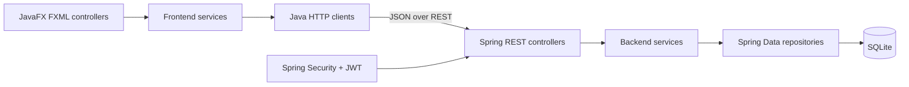

# ResolveIT Developer Guide

This guide describes the current `0.1.0` codebase. See the
[User Guide](UserGuide.md) for setup and usage.

## Architecture

ResolveIT is a two-process desktop application. The frontend and backend share REST
contracts but no source modules.



### Frontend

- `ui` and FXML files define the employee, technician, and manager views.
- `navigation.Navigator` loads views, injects controllers, and disposes the previous
  controller through `ViewLifecycle`.
- `auth`, `ticket`, and `user` services contain validation and use-case logic.
- `HttpAuthClient` and `HttpTicketClient` perform JSON REST calls asynchronously so
  network work does not block the JavaFX Application Thread.
- `SessionState` stores access and refresh credentials, their expiry times, and
  the signed-in user in memory only. `AuthService` renews near-expiry access
  tokens and shares one refresh operation among concurrent requests.

### Backend

- REST controllers validate request shapes and delegate to application services.
- `AuthService`, `UserService`, and `TicketService` enforce role permissions,
  visibility, ticket transitions, and other business rules inside transactions.
- Spring Data JPA repositories persist `User`, `Ticket`, and `TicketMessage`
  entities. `schema.sql` owns the schema; Hibernate validates it at startup.
- SQLite uses one pooled connection with foreign keys enabled. Ticket `version`
  provides optimistic-lock protection, while taking a ticket uses an atomic update.
- Spring Security issues 15-minute HS256 JWT access tokens, checks that the user is
  still active, and protects manager endpoints by role. Opaque refresh tokens are
  stored as hashes, expire after seven days, rotate on use, and can be revoked.
  Repeated failed logins are temporarily rate-limited by normalized email and
  direct client address. The checked-in JWT secret is for local development only.

The API implements login, token refresh, authenticated logout, current-user lookup,
ticket and message workflows, and manager user administration. The frontend
renews a near-expiry access token before protected requests and retries one request
after a `401`. Sign-out asks the backend to revoke the current refresh token and
always clears local state. Closing the application clears its in-memory state, so
the user signs in again on the next launch. Updates are manual rather than
real-time.

## Software engineering process

[`requirements/PROJECT.md`](../requirements/PROJECT.md) is the product and API source of truth. Work is divided
by role and layer, then implemented with repository-specific backend, JavaFX,
review, logging, and commit skills under [`.agents/skills`](../.agents/skills).
Material AI interactions are summarised under [`logs`](../logs).

Backend integration tests exercise authentication, authorisation, persistence, and
ticket/user workflows. Frontend tests cover validation, session/configuration,
services, HTTP contracts, and error mapping using local test servers. Run:

```bash
cd backend && ./gradlew check
cd ../frontend && ./gradlew check
```

Each `check` runs the module's tests and Checkstyle across all production and
test Java source. Run `./gradlew checkstyleMain checkstyleTest` in either module
when only static source checks are needed. The shared rules are in
`config/checkstyle/checkstyle.xml`; HTML reports are written under each module's
`build/reports/checkstyle/` directory. Checkstyle enforces objective formatting
rules globally; the code-review workflow separately checks whether changed
public APIs and non-trivial methods need useful Javadocs.

Visible JavaFX behaviour is checked manually; no FXML/UI test remains in the current
suite. GitHub Actions runs each module's tests and repository-wide Checkstyle gate as
independent CI jobs on pushes and pull requests, then uploads one cross-platform
executable JAR for each module. Changes should be reviewed against
`requirements/PROJECT.md`, tested in the affected module, documented, and
committed as focused Conventional Commits.

## Key extension points

- Add backend behaviour through the matching controller, service, repository, DTO,
  and integration-test path.
- Add frontend behaviour through a service/client interface first, then connect it
  to a controller and FXML view.
- Keep permissions and workflow rules authoritative on the backend; UI restrictions
  are only a usability aid.
- Preserve stable error codes and REST payloads because the desktop client maps
  them to user-facing failures.

## Acknowledgements

- The course specification in [`requirements/MP2-requirements.md`](../requirements/MP2-requirements.md)
  defines the assignment constraints and documentation requirements.
- The backend uses [Spring Boot](https://spring.io/projects/spring-boot/), Spring
  MVC, Spring Data JPA, Spring Security, Hibernate's community SQLite dialect, and
  the [Xerial SQLite JDBC driver](https://github.com/xerial/sqlite-jdbc).
- The frontend uses [OpenJFX](https://openjfx.io/) and
  [Jackson](https://github.com/FasterXML/jackson).
- Builds use the [Gradle Wrapper](https://docs.gradle.org/current/userguide/gradle_wrapper_basics.html),
  whose checked-in generated scripts are provided under the Apache License 2.0.
  Tests use [JUnit](https://junit.org/) and Spring's test libraries.
- The code-review guidance references the
  [SE-EDU Java coding standard](https://se-education.org/guides/conventions/java/)
  and NUS software-engineering guidance linked from the review skill.
- OpenAI Codex assisted with specification refinement, implementation, tests,
  explanations, refactoring, and documentation. The interaction summary is in
  [`logs/summary-1.md`](../logs/summary-1.md).

Beyond the frameworks, generated Gradle Wrapper files, course material, engineering
guidance, and AI assistance listed above, no reused application code or
documentation is recorded in the repository.
