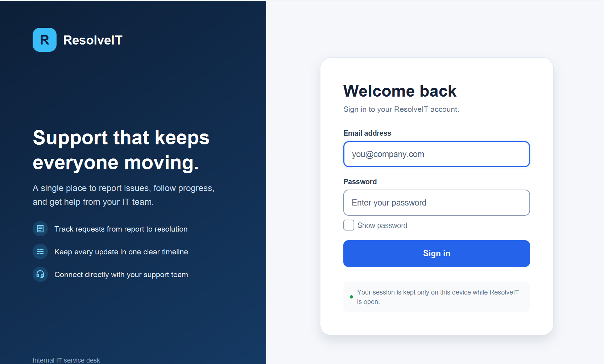
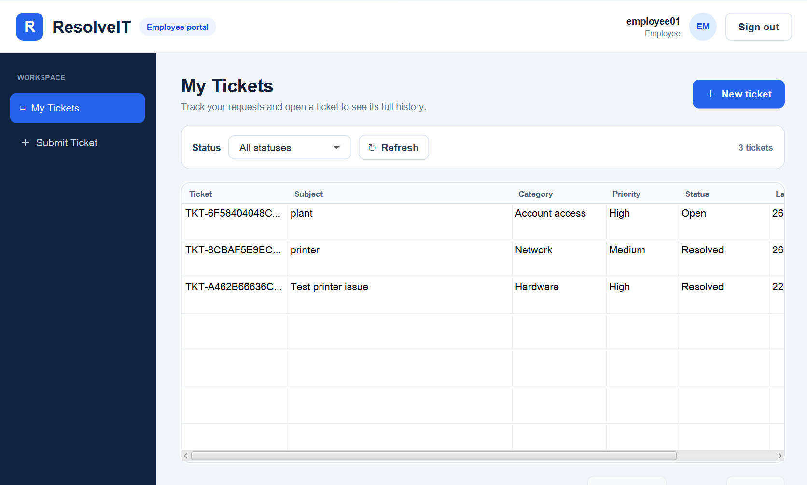
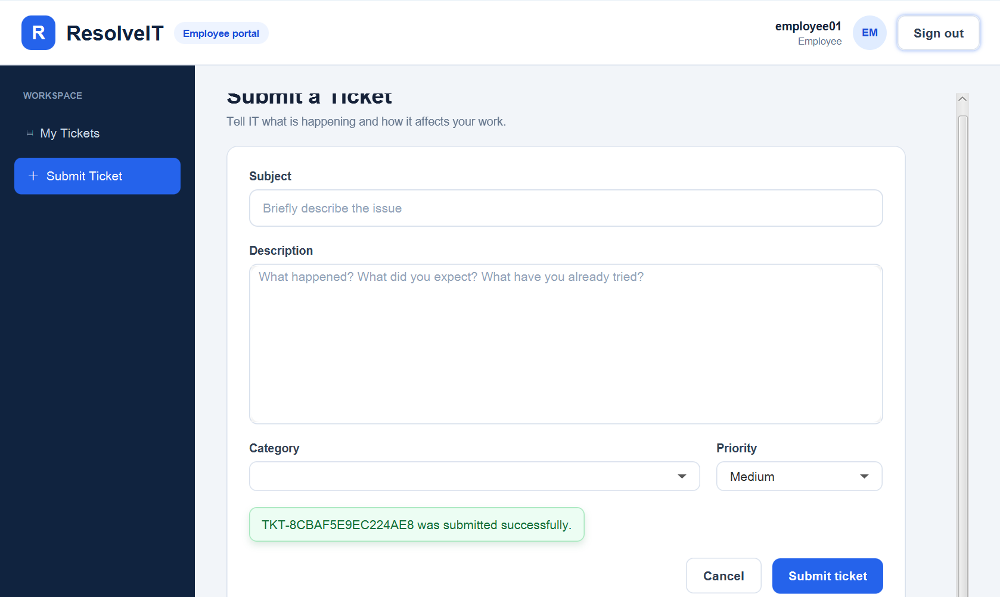
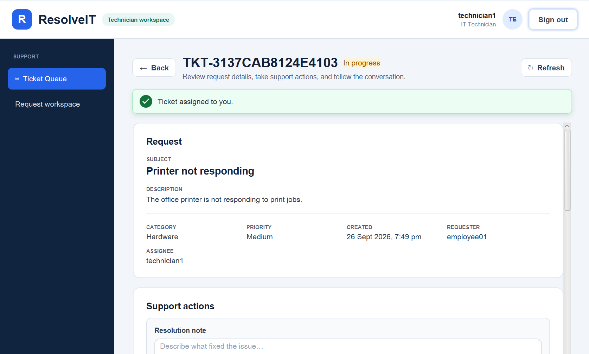
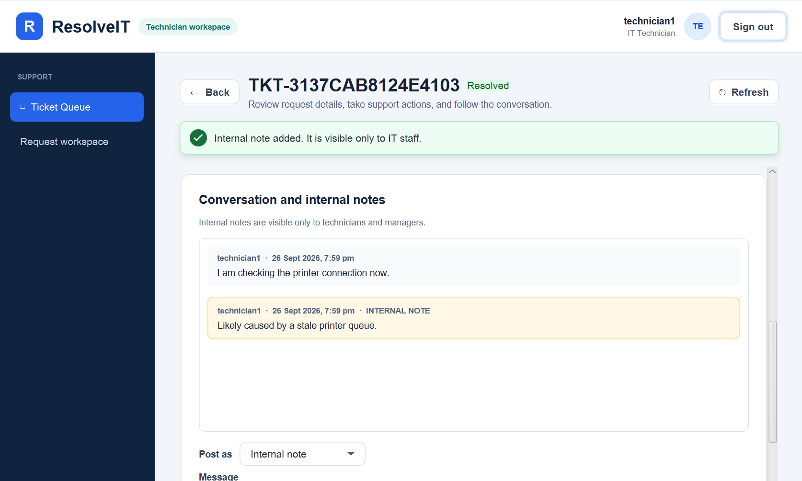
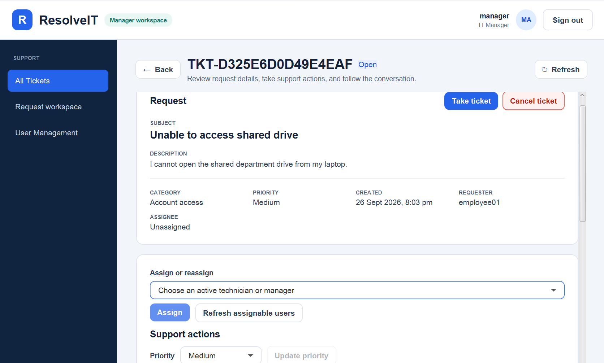
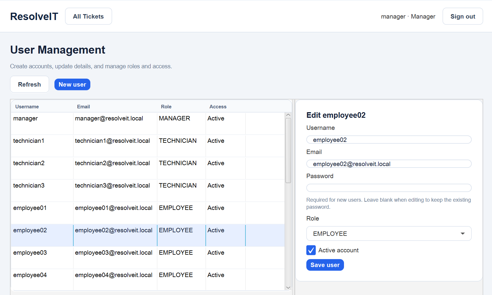
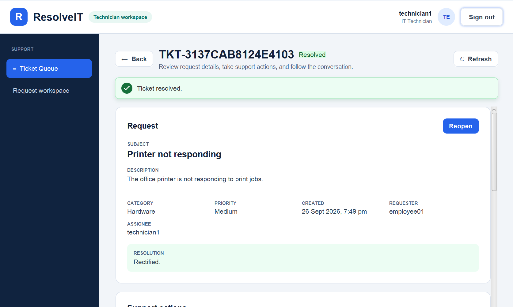

# ResolveIT User Guide

## 1. About ResolveIT and this guide

ResolveIT is a JavaFX desktop help-desk application backed by a Spring Boot API
and SQLite database. Employees submit requests, technicians handle tickets, and
managers assign work and manage accounts.

This guide helps users exercise the implemented behaviour. Attachments, email notifications, reports,
and real-time updates are outside the current scope.

## 2. Set up and run

### Packaged application

1. Install Java 25 and check `java -version`. The client needs a graphical desktop;
   Java is not bundled with the application.
2. Download both JARs from an available project release, or extract the
   `resolveit-cross-platform-jars` artifact from a successful GitHub Actions
   packaging run. Locate `resolveit-backend-0.1.0.jar` and
   `resolveit-frontend-0.1.0.jar` in the extracted files.
3. In a terminal in the directory containing the backend JAR, run:

   ```text
   java -jar resolveit-backend-0.1.0.jar
   ```

4. Wait for the backend startup log to report that the application has started.
   Keep that terminal running. In a second terminal, in the directory containing
   the frontend JAR, run:

   ```text
   java --enable-native-access=ALL-UNNAMED -jar resolveit-frontend-0.1.0.jar
   ```

The login window should appear. These commands are the same on Windows and Linux.
The package includes native libraries for both platforms. CI checks JAR contents, not application
startup on both platforms.

### Run from source (alternative)

Install JDK 25 and check `java -version` and `javac -version`. Extract or clone the
repository. The supplied Gradle wrappers download Gradle and dependencies on first
use, so internet access is needed; no separate Gradle installation is required.

Start the backend from the repository root:

| Windows PowerShell | Linux |
| --- | --- |
| `cd backend` | `cd backend` |
| `.\gradlew.bat bootRun` | `./gradlew bootRun` |

After backend startup, open a second terminal **at the repository root**:

| Windows PowerShell | Linux |
| --- | --- |
| `cd frontend` | `cd frontend` |
| `.\gradlew.bat run` | `./gradlew run` |

### Configuration and stopping

The client connects to `http://localhost:8080/api/v1` by default. To override it,
set this variable in the frontend terminal before launching:

| Windows PowerShell | Linux |
| --- | --- |
| `$env:RESOLVEIT_API_BASE_URL = "http://localhost:8080/api/v1/"` | `export RESOLVEIT_API_BASE_URL="http://localhost:8080/api/v1/"` |

The backend creates `resolveit.db` in its working directory by default:
`backend/resolveit.db` with the source commands above. For a separate test database,
set this variable in the backend terminal before starting it:

| Windows PowerShell | Linux |
| --- | --- |
| `$env:RESOLVEIT_DB_PATH = "peer-test.db"` | `export RESOLVEIT_DB_PATH="peer-test.db"` |

Restart with the same database path to retain saved work. Close the client window,
then press Ctrl+C in the backend terminal to stop the application.
Demo accounts and the default JWT secret are for local development only. The
project requires HTTPS outside local development; this default setup uses local HTTP.

## 3. Demo accounts and first sign-in

| Role | Email | Password |
| --- | --- | --- |
| Employee | `employee01@resolveit.local` | `Employee123!` |
| Technician | `technician1@resolveit.local` | `Technician123!` |
| Manager | `manager@resolveit.local` | `Manager123!` |

The demo seeder also creates employees `employee02@resolveit.local` through
`employee30@resolveit.local` with the employee password, and technicians
`technician2@resolveit.local` and `technician3@resolveit.local` with the technician
password. These 34 active accounts are inserted only when the users table is empty
and demo seeding is enabled (the default). No sample tickets are inserted.

Enter an **email address**, not a username, and its password, then sign in.
Employees should see My Tickets, technicians Ticket Queue, and managers All
Tickets. Restarting does not restore passwords or roles changed during testing.



## 4. Navigation and shared controls

| Role | Main navigation |
| --- | --- |
| Employee | My Tickets; Submit Ticket |
| Technician | Ticket Queue; Request workspace |
| Manager | All Tickets; Request workspace; User Management |

- Double-click a ticket row or select it and press Enter to open details.
- Use filters to narrow lists, Previous/Next to change pages, and Back to return.
- Use the refresh controls to retrieve changes; real-time updates are not supported.
- Loading indicators show requests in progress; wait for an action to finish before
  retrying it.
- The header shows your account and role. Use Sign out before switching accounts.
- For technicians and managers, Request workspace provides Submit Ticket and a
  **Visible tickets** list. That list follows role visibility, not an own-tickets-only
  filter. Use Support workspace to return to support actions.



## 5. Employee workflows

Employees can submit, view, and filter their tickets; edit open unassigned tickets;
cancel eligible tickets; reopen resolved tickets; and add public comments.

### Submit and find a ticket

1. Sign in as `employee01@resolveit.local` and open Submit Ticket.
2. Enter subject `Cannot connect to office Wi-Fi` and description
   `My laptop reports an authentication error on the office network.`
3. Choose Network and Medium, then select Submit ticket.
4. Note the generated `TKT-...` number in the success message. Open My Tickets and
   locate it; refresh if needed, then open its details.

**Expected:** after successful submission, the success message shows the generated
ticket number. Subject, Description, and Category are cleared, and Priority resets
to the default Medium. The new ticket is `OPEN` and unassigned. My Tickets shows
this employee's requests; changing the Status filter narrows the list.



### Edit and comment

1. While your ticket is Open and unassigned, select Edit.
2. Change its subject, description, category, or priority, then Save changes.
   Use Discard to leave editing without saving.
3. Enter a public comment such as `The issue still occurs after restarting.` and
   select Post comment.

**Expected:** saved fields appear in details and the comment appears in the
conversation. Editing is unavailable once the ticket is assigned or leaves Open.
Employees cannot read or post internal notes.

### Cancel or reopen

- **Cancel:** create a second test ticket, open it, select Cancel ticket, and confirm.
  An Open or In progress ticket becomes Cancelled and cannot be reopened.
- **Reopen:** after a technician resolves your first ticket, refresh its details,
  select Reopen ticket, and confirm. Its status returns to `OPEN`, its assignee
  becomes unassigned, and the active resolution display is cleared.

## 6. Technician workflows

Technicians can view and filter the support queue, take tickets, begin work,
change priority, resolve assigned work, reopen tickets, and add public comments
or internal notes.

### Take and work on a ticket

1. Sign in as `technician1@resolveit.local` and open Ticket Queue.
2. Filter by Open and Unassigned, then open the employee's test ticket.
3. Select Take ticket and confirm.
4. Choose a different priority and select Update priority if needed.

**Expected:** taking assigns the ticket to you and changes it to In progress in
one action. If a manager instead assigns an Open ticket to you, open it and select
Begin work to move it to In progress.

The queue offers status, priority, and assignment filters (Any assignment, Unassigned,
Assigned to me). Technicians can see Open/In progress tickets, their own requests,
and tickets assigned to them. Resolved or Cancelled own/assigned tickets can
therefore remain visible. A resolved ticket assigned to you remains visible in
Ticket Queue under All statuses. The technician status filter has no Cancelled option;
use All statuses when checking that case.



### Communicate and resolve

1. In details, choose Public comment under Post as, enter a message, and post it.
2. Choose Internal note and post a separate note for support staff.
3. Enter resolution note `Cleared the stuck print queue and restarted the printer service.`
   Select Resolve ticket and confirm.
4. Switch to the employee account and refresh the ticket.

**Expected:** the assigned technician can resolve an In progress ticket with a
non-blank note. The ticket becomes Resolved and shows its resolution. The employee
sees the public comment and resolution, but not the internal note. Support users
can reopen a resolved ticket they can open in the UI; reopening returns it to `OPEN`,
makes it unassigned, and clears the active resolution display as described above.

For your own requests, use Request workspace and follow the employee workflows.
Only your own Open, unassigned requests can be edited there.



## 7. Manager workflows

Managers perform technician actions, view all tickets, assign tickets, and create
or edit user accounts, roles, and activation status.

### Assign or reassign work

1. Sign in as `manager@resolveit.local` and open All Tickets.
2. Open an Open or In progress ticket.
3. Under Assign or reassign, choose an active technician or manager and select
   Assign. Use Refresh assignable users after account changes.
4. To reassign, select another eligible user and select Assign again.

**Expected:** the assignee changes but the status does not. An assigned Open ticket
still needs Begin work. Resolved and Cancelled tickets cannot be assigned.
Managers can begin or resolve work assigned to others and cancel eligible tickets.
All Tickets includes resolved and cancelled tickets, with status, priority, and
assignment-scope filters.



### Create and update accounts

1. Open User Management and select New user.
2. Enter a unique username and email, a password, and a role; choose whether the
   account is active. Select Save user.
3. Select an existing account to edit its details. Leave Password empty to keep
   its current password, or enter a replacement.
4. Change its role or Active account selection if needed, save, and confirm the
   access-change dialog.

**Expected:** saved details appear in the user list. Inactive accounts cannot sign
in. Saving any change to your own account returns you to login; sign in again to
use the saved details and role. Use a separate test account for access experiments
so the demo manager remains available. Account changes do not automatically
reassign existing tickets.



## 8. Ticket lifecycle and permissions

The requester is the account that submitted a ticket. UI labels such as In progress
correspond to API statuses such as `IN_PROGRESS`.

| Action | Starting state | Expected result | Allowed user |
| --- | --- | --- | --- |
| Submit | New request | `OPEN`, unassigned | Any active signed-in user |
| Edit request fields | `OPEN`, unassigned | Fields saved; status unchanged | Requester |
| Take | `OPEN`, unassigned | `IN_PROGRESS`, assigned to actor | Technician or manager |
| Assign/reassign | `OPEN` or `IN_PROGRESS` | Assignee changes; status unchanged | Manager |
| Begin work | `OPEN`, assigned | `IN_PROGRESS` | Assigned technician or manager |
| Resolve with note | `IN_PROGRESS` | `RESOLVED`, resolution recorded | Assigned technician or manager |
| Cancel | `OPEN` or `IN_PROGRESS` | `CANCELLED` | Requester or manager |
| Reopen | `RESOLVED` | `OPEN`, unassigned, active resolution display cleared | Requester or support user with access through the UI |

Cancelled tickets cannot be reopened. Use the named actions rather than expecting
an unrestricted status selector. Public comments are allowed on visible tickets,
including terminal states; support users can also post internal notes and change
priority on visible tickets. The backend checks permissions and current state even
if a control was available when you loaded the screen.



## 9. Refresh, persistence, and sessions

- **Displayed data:** there is no periodic polling. Refresh to see another user's
  changes. Successful actions update or reload relevant local data; submission
  shows a success message on its form.
- **Conflicts:** if another action changed a ticket, the client attempts to reload
  its latest state. Review the result before retrying. If reloading fails, refresh
  after restoring the connection. Do not rely on unsaved edits surviving a reload.
- **Conversation limit:** the current client loads the first 100 visible messages,
  oldest first, with no controls to load later pages. A newly posted message can
  appear immediately but fall outside that first page after refreshing.
- **Saved data:** users, tickets, and messages are stored in SQLite. Restart with
  the same database path to retain them; restarting does not reset demo data.
- **Session renewal:** the app renews an active session automatically when possible
  as requests need fresh credentials. A failed renewal can require signing in again.
- **Sign out:** clears local credentials and attempts to revoke the current server
  refresh token. Server revocation may fail when the backend is unreachable.
- **Close/relaunch:** credentials are held in memory only, so the next launch
  requires a new sign-in. Closing the window does not explicitly revoke the server
  refresh token.

## 10. Validation and troubleshooting

### Input rules

| Field | Rule |
| --- | --- |
| Subject | 5–200 characters after trimming |
| Description | 10–10,000 characters after trimming |
| Comment/internal note | 1–5,000 characters after trimming |
| Resolution note | 1–10,000 characters after trimming |
| Category | Hardware, Software, Network, Account Access, Other |
| Priority | Low, Medium, High |
| Username | 3–50 characters after trimming; unique ignoring case |
| Email | Valid format, at most 254 characters; unique ignoring case |
| Password | Form accepts 5–100 characters, not all whitespace; required for new accounts; empty on edit keeps the password |

Use the demo passwords or short ASCII test passwords for the basic walkthrough;
long or non-ASCII password handling needs separate verification. The backend also
validates requests, so a server rejection can appear after local validation passes.

### Common problems

| Symptom | What to check or do |
| --- | --- |
| Java or Gradle does not start | Check Java/JDK 25, your working directory, and the correct wrapper command. First source builds need dependency downloads. |
| Login window cannot connect | Keep the backend running; check its terminal for startup errors and verify the client's API URL. |
| Backend reports port 8080 is in use | Check whether another backend is already running; stop the duplicate process you started before retrying. |
| Sign-in rejected | Use email rather than username; check password and active status. Demo credentials may have been changed. |
| Sign-in temporarily limited | Repeated failed sign-ins are temporarily limited. Defaults allow five failures in a ten-minute window before a one-minute block for that email/client address. Wait before retrying. |
| No tickets shown | Clear filters, refresh, and check role visibility. A fresh database contains no tickets. |
| An action is missing or rejected | Check ownership, assignment, and status against section 8; refresh to retrieve changes. |
| Ticket conflict | Review reloaded details before reapplying a change. Another user may have taken, assigned, or updated the ticket. |
| Data appears to have disappeared | Check the backend working directory and `RESOLVEIT_DB_PATH`; a different path uses a different database. |
| Existing database fails schema validation | Schema upgrades are outside this version's scope. Preserve the original database and use a separate fresh test database for this build. |
| Request fails or session expires | Restore the backend connection, refresh, and sign in again if returned to login. Check whether a change succeeded before submitting it again. |
